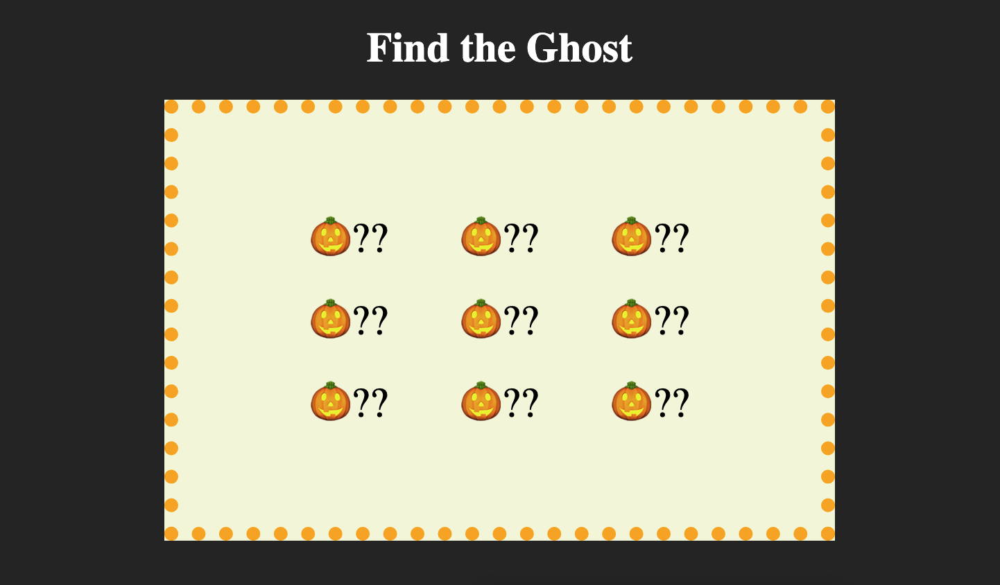
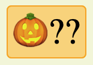
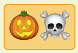
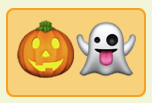

# css-card

## Learning Target
- I am practicing using CSS box-model properties and special selectors

## Success Criteria
- I can set box model properties such as ```padding```, ```margin```, and ```border```
- I can combine ```:hover``` or ```:active``` with ```::before``` or ```::after``` to insert content when an element is hovered or clicked
- I can use CSS to create a little Halloween themed game


## Directions
1. Install Live Server and Go Live to view how the webpage looks with no styling
2. Follow directions below

## Assignment
I've given you the HTML to create a little Halloween game.
1. First, use CSS to style it to look like the screenshot below. You shouldn't modify the HTML at all, only CSS.  
    - Look through ```index.html``` to determine what tags, classes, and ids you can use to select elements for styling  
    ```css
    tagname {} /* to select by tag name */
    .classname {} /* to select by class name */
    #idname {} /* to select by id */
    .classname tagname {} /* to select a tag inside a class */
    ```
    - You will need to set ```background-color```, ```width```, ```padding```, ```margin```, ```border```, ```font-size```, and ```border-radius``` for several different elements
    - Use ```::after``` to add the ?? after each jack-o-lantern elements.  

2. Next, use ```:hover``` to make it look like this when each jack-o-lantern is hovered by the mouse.  

3. Then, use ```:active::after``` to make it so a ☠️ appears when each jack-o-lantern is clicked.  

4. Finally, use ```:active::after``` to make it so a 👻 appears when *one* of the jack-o-lanterns is clicked. You pick which one.  

